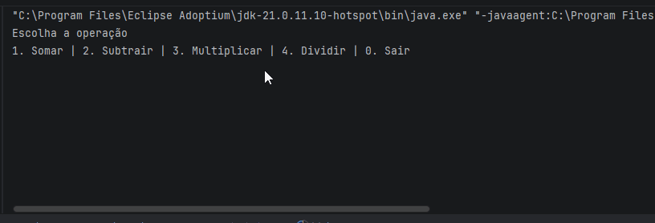

# Calculadora Java

Calculadora de console feita em Java, aplicando o padrão de projeto **Strategy** para separar cada operação matemática em sua própria classe.

> ⚠️ Este é um projeto em evolução — o README será atualizado a cada nova versão, documentando as melhorias e decisões técnicas.

## Demonstração



## Funcionalidades

- Soma, subtração, multiplicação e divisão
- Menu interativo via terminal
- Loop contínuo até o usuário optar por sair

## Como executar

```bash
git clone https://github.com/alexxnunes/Calculadora.git
cd Calculadora
javac com/calculadora/*.java -d out
java -cp out com.calculadora.Main
```

Ou abra o projeto direto no IntelliJ IDEA e rode a classe `Main.java`.

## Arquitetura

O projeto usa o padrão **Strategy**: a interface `Operacao` define o contrato `calcular(double a, double b)`, e cada operação (`Soma`, `Subtracao`, `Multiplicar`, `Dividir`) implementa esse contrato de forma independente. O `Menu` decide qual implementação instanciar com base na escolha do usuário, sem precisar de `if/else` para cada operação.

```
com.calculadora
├── Main.java         # ponto de entrada
├── Menu.java          # interação com o usuário (Scanner)
├── Operacao.java      # interface (contrato Strategy)
├── Soma.java
├── Subtracao.java
├── Multiplicar.java
└── Dividir.java
```

## Tecnologias

- Java 21+ (uso de `switch` expression)

## Changelog

### v1.0
- Estrutura inicial com padrão Strategy
- Quatro operações básicas via menu de terminal

---

Desenvolvido por [Alexander Nunes](https://github.com/alexxnunes).
